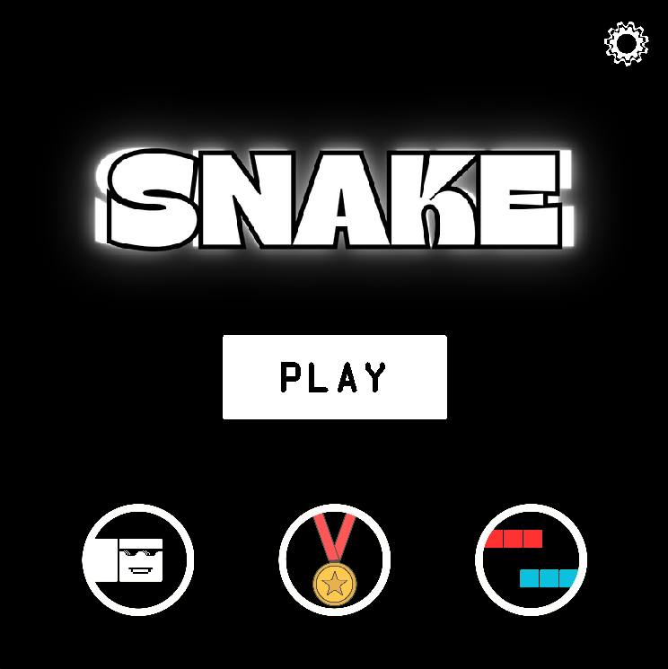
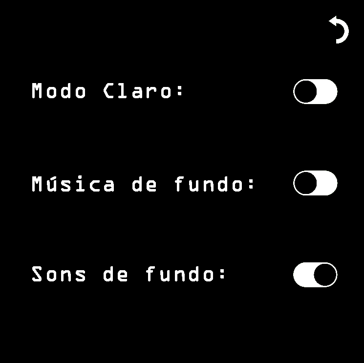
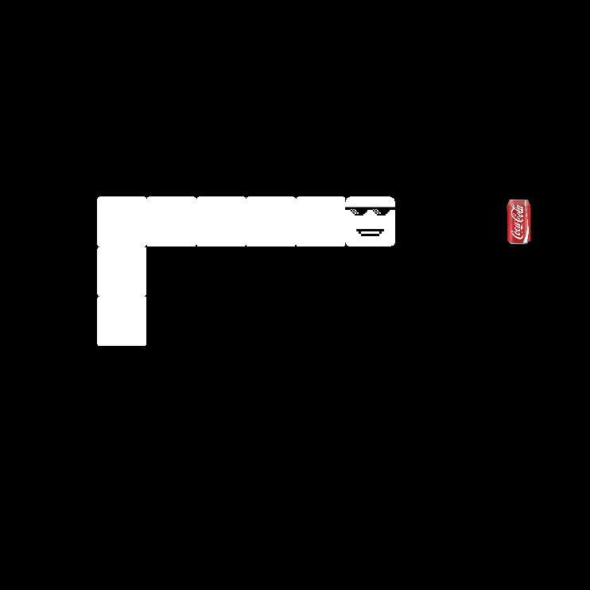

# Snake Game - Classic Arcade in Java

An implementation of the legendary Snake Game, developed in Java as an academic project for the "Modelação e Programação" course. This project demonstrates the practical application of  Graphical User Interface (GUI) manipulation using Swing, and data persistence using XML.

The objective of the game is simple and highly addictive: control the snake using the keyboard arrow keys to eat the food that randomly spawns on the screen. With every meal, the snake grows, increasing the difficulty as the player must avoid colliding with the scenario's walls or the snake's own tail.

## 🎮 Key Features

* **Classic Gameplay:** Game mechanics faithful to the original, featuring responsive controls and progressive difficulty.
* **Dynamic Graphical Interface (Swing):** Real-time rendering of the game board, the snake, and the food using `javax.swing` components.
* **High Score Persistence (XML):** A built-in system that records and saves the highest scores achieved across different difficulties (Easy, Medium, Hard, Hardcore). The `BaseDeDados.xml` file is dynamically updated to ensure your records are kept safe between sessions.
* **Precise Collision Logic:** Accurate collision detection against the board limits and the snake's own body segments.
* **Snake Growth:** The snake increases in size every time food is consumed, constantly challenging the player's spatial awareness.

## 🏗️ Project Architecture

The project follows a modular architecture based on Object-Oriented Programming, with a clear separation of responsibilities among its classes:

* **`Main.java`:** The entry point of the application, responsible for instantiating the game window (`JFrame`) and starting the game.
* **`JogoDaCobra.java`:** The core class containing the game logic. It manages the game state, the main loop (`ActionListener`), keyboard inputs (`KeyListener`), snake movement, and collision detection.
* **`Grelha.java`:** Represents the board or grid where the game takes place. It defines the grid dimensions (x, y coordinates) to manage positions.
* **`Pontos.java`:** A data-holding class used to manage the score arrays for different difficulty levels.
* **`BaseDeDados.xml`:** The XML data file used to store high scores, ensuring that the maximum score persists between game sessions.

To visualize the relationships between these classes, you can consult the **UML Diagram** included in the repository.

### 📸 Visual Demonstration

|  |  |

|  |  |

## 🚀 How to Run the Project

### Prerequisites
* **Java Development Kit (JDK)** installed on your system (version 8 or higher).

### Steps to Play
1. Download or clone this repository to your local machine.
2. Run the `Main.java` class.
